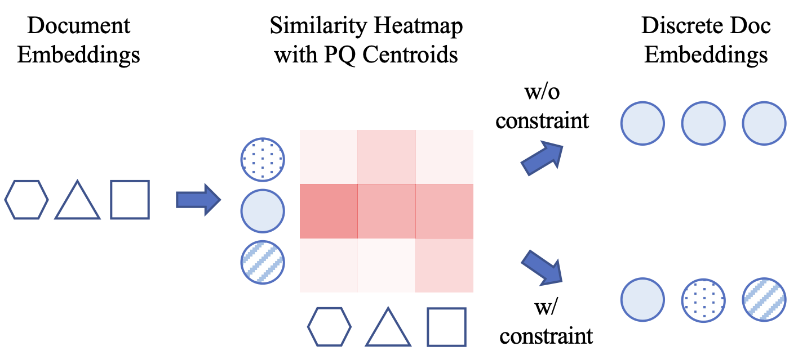
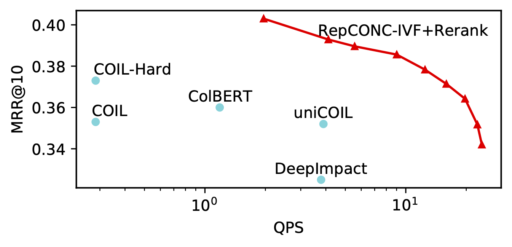

# RepCONC

This is the official repo for our WSDM'22 paper, [Learning Discrete Representations via Constrained Clustering for Effective and Efficient Dense Retrieval](https://arxiv.org/pdf/2110.05789.pdf). 

**************************** **Updates** ****************************
* 11/13: We released code to evaluate [zero-shot retrieval performance](#zero-shot-retrieval) of RepCONC and used BEIR benchmark as an example.
* 11/5: We released [ranking results](#ranking-results) for queries from MS MARCO development set and TREC 2019 Deep Learning Track.
* 11/3: We released code for [encoding corpus](#encode-corpus) and [IVF acceleration](#build-ivf-index).
* 11/2: We released our [model checkpoints](#models-and-indexes) and [retrieval code](#retrieval).
* 10/13: Our paper has been accepted by WSDM! Please check out the [preprint paper](https://arxiv.org/pdf/2110.05789.pdf).

## Quick Links

  - [Quick Tour](#quick-tour)
  - [Ranking Results](#ranking-results)
  - [Requirements](#requirements)
  - [Preprocess Data](#preprocess)
  - [Evaluate Open-sourced Checkpoints](#evaluate-open-sourced-checkpoints)
    - [Model Checkpoints](#models-and-indexes)
    - [Encode Corpus](#encode-corpus)
    - [Build IVF Index](#build-ivf-index)
    - [Run Retrieval](#retrieval)
    - [Zero-shot Retrieval (BEIR)](#zero-shot-retrieval)
  - [Train RepCONC](#training)
  - [Citation](#citation)
  - [Related Work](#related-work)

## Quick Tour 

In this work, we propose RepCONC, which models quantization process as CONstrained Clustering and end-to-end trains the dual-encoders and the quantization method. Constrained clustering involves a clustering loss and a uniform clustering constraint. The clustering loss requires the embeddings to be around the quantization centroids to support end-to-end optimization, and the constraint forces the embeddings to be uniformly clustered to all centroids to maximize distinguishability. 
The training process and the clustering constraint are visualized as follows:

Training process   |  Constrained Clustering
:-------------------------:|:-------------------------:
  |  

RepCONC achieves huge compression ratios ranging from 64x to 768x. It supports fast embedding search thanks to the adoption of IVF (inverted file system). With these designs, it outperforms a wide range of first-stage retrieval methods in terms of effectiveness, memory efficiency, and time efficiency. 
RepCONC also substantially boosts the second-stage ranking performance, as shown below:
<p align="center">
  
</p>

## Ranking Results

We provide the ranking results of RepCONC via the following two links: [passage rank](https://www.dropbox.com/sh/5if2rgdmhhupif3/AADjBW8YiSvUKFPfC-3OOZqJa?dl=0) and [document rank](https://www.dropbox.com/sh/tyc1jzgwwclmfmu/AACO7Tf4cJEbmfQoz7xJnUaEa?dl=0). 
`dev` folder and `test` folder correspond to MS MARCO development queries and TREC 2019 DL queries, respectively. 
In either folder, for each `m` value, we provide two ranking files corresponding to different text-id mapping. The one prefixed with 'official' means that it uses the official MS MARCO / TREC 2019 text-id mapping so you can directly use the official qrel files to evaulate the ranking. The other one uses the mapping generated by our [preprocessing](#preprocess) where we use line offset as id. Both files will give you the same metric number. The files are generated by [run_retrieve.sh](./cmds/run_retrieve.sh). Please see [evaluation section](#evaluate-open-sourced-checkpoints) to know about how to get those ranking results. 


## Requirements

This repo needs the following libraries (Python 3.x):
```
torch == 1.9.0
transformers == 4.3.3
faiss-gpu == 1.7.1
boto3
```
We reuse many scripts of [JPQ](https://github.com/jingtaozhan/JPQ) library. Run the following installation command
```bash
pip install git+https://github.com/jingtaozhan/JPQ
```

## Preprocess
Here are the commands to for preprocessing/tokenization. 

If you do not have MS MARCO dataset, run the following command:
```
bash download_data.sh
```
Preprocessing (tokenizing) only requires a simple command:
```
python -m jpq.preprocess --data_type 0; python -m jpq.preprocess --data_type 1
```
It will create two directories, i.e., `./data/passage/preprocess` and `./data/doc/preprocess`. We map the original qid/pid to new ids, the row numbers in the file. The mapping is saved to `pid2offset.pickle` and `qid2offset.pickle`, and new qrel files (`train/dev/test-qrel.tsv`) are generated. The passages and queries are tokenized and saved in the numpy memmap file. 

## Evaluate Open-sourced Checkpoints
### Models and Indexes

You can download the query encoders and indexes from our [dropbox link](https://www.dropbox.com/sh/4xqve2ixf0nrva3/AABm6Z1Ase2AC0ZpJhSrVJzGa?dl=0). After opening this link in your browser, you can see two folder, `doc` and `passage`. They correspond to MSMARCO passage ranking and document ranking. There are also four folders in either of them:
* Encoders: 
  * `official_doc_encoders`:  The unified query/document encoder output from the first-stage training. RepCONC adopts [STAR](https://arxiv.org/pdf/2104.08051.pdf) negative sampling method in this stage. 
  * `official_query_encoders`: The query encoder output from the second-stage training. RepCONC adopts [ADORE](https://arxiv.org/pdf/2104.08051.pdf) negative sampling method in this stage.
* Indexes (Note, the `pid` in the index is actually the row number of a passage in the `collection.tsv` file instead of the official pid provided by MS MARCO.): 
  * `official_pq_index`: PQ indexes.   
  * `official_ivf_index`: IVF accelerated PQ indexes. The number of inverted lists is set to 5000. 

Different query encoders and indexes correspond to different compression ratios. For example, the query encoder named `m32.marcopass.query.encoder.tar.gz` means 32 bytes per doc, i.e., `768*4/32=96x` compression ratio.

We provide several scripts to help you download these data.
```bash
sh ./cmds/download_query_encoder.sh
sh ./cmds/download_doc_encoder.sh
sh ./cmds/download_index.sh
```
### Encode Corpus

In this section, we provide commands about how to encode the corpus to compact indexes with our provided encoders. 
Note, you can skip this section and download the open-sourced indexes by running (only once): 
```bash
sh ./cmds/download_index.sh
```

To encode the corpus:

First, you need to [preprocess the dataset](#preprocess).

Second, please download the [open-sourced query and document encoders](#models-and-indexes). Here are two scripts to help you download them.
```bash
sh ./cmds/download_query_encoder.sh
sh ./cmds/download_doc_encoder.sh
```

Finally, run [run_encode.py](run_encode.py) to encode corpus. You can refer to the example commands in [cmds/run_encode_corpus.sh](cmds/run_encode_corpus.sh).
Arguments for [run_encode.py](run_encode.py) script are as follows,
* `--preprocess_dir`: preprocess dir
    * `./data/passage/preprocess`: default dir for passage preprocessing.
    * `./data/doc/preprocess`: default dir for document preprocessing.
* `--doc_encoder_dir`: The unified query/document encoder trained in the first-stage training process. The script uses it to generate Index Assignments for all passages/documents.  
* `--query_encoder_dir`:  The query encoder trained in the second-stage training process. The script uses it to set the centroid embeddings. If it is not provided, the centroid embeddings are set according the `--doc_encoder_dir` model. 
* `--output_path`:  Output index path.
* `--max_doc_length`: Max passage/document length. Set it to 256 for passage and 512 for document, respectively.
* `--batch_size`: Encoding batch size.

### Build IVF Index
In this section, we provide commands about how to use IVF to accelerate search. The IVF index is built upon the PQ index output by [run_encode.py](run_encode.py).
Note, you can skip this section and download the open-sourced indexes by running (only once): 
```bash
sh ./cmds/download_index.sh
```

We provide an example command in [run_build_ivf_index.sh](cmds/run_build_ivf_index.sh). It builds an IVFPQ index for MS MARCO Passage Ranking task. It calls [build_ivf_index.py](build_ivf_index.py). Arguments for this script are as follows,
* `--input_index_path`: The path for index output by [run_encode.py](run_encode.py).
* `--output_index_path`: The output index path.
* `--nlist`: The number of inverted lists. Large nlist improves accuracy at the cost of computation overhead.
* `--nprobe`: The number of searched lists during online retrieval. The ideal IVF speedup ratio equals to nlist/nprobe.
* `--threads`: The number of threads.
* `--by_residual`: Whether to combine IVF and PQ embeds. Default: False.


### Retrieval

In this section, we provide commands about how to reproduce the retrieval results with our open-sourced indexes and query encoders.
Since we use [TREC_EVAL toolkit](https://trec.nist.gov/trec_eval/) for evaluation, please download it and compile:
```
sh ./cmds/download_trec_eval.sh
``` 
Run the following command to evaluate the retrieval results.
```bash
sh ./cmds/run_retrieval.sh
```
or this command to evaluate the ivf accelerated search results:
```bash
sh ./cmds/run_ivf_accelerate_retrieval.sh
```
Both of them will call [run_retrieve.py](run_retrieve.py) to retrieve candidates.
Arguments for this evaluation script are as follows,
* `--preprocess_dir`: preprocess dir
    * `./data/passage/preprocess`: default dir for passage preprocessing.
    * `./data/doc/preprocess`: default dir for document preprocessing.
* `--mode`: Evaluation mode
    * `dev` run retrieval for msmarco development queries.
    * `test`: run retrieval for TREC 2019 DL Track queries.
    * `lead`: run retrieval for leaderboard queries.
* `--index_path`: Index path (can be either PQ index or IVF accelerated index)
* `--query_encoder_dir`:  Query encoder dir, which involves `config.json` and `pytorch_model.bin`.
* `--output_path`:  Output ranking file path, formatted following msmarco guideline (qid\tpid\trank).
* `--max_query_length`: Max query length, default: 32.
* `--batch_size`: Encoding and retrieval batch size at each iteration.
* `--topk`: Retrieve topk passages/documents.
* `--gpu_search`: Whether to use gpu for embedding search.
* `--nprobe`: How many inverted lists to probe. This value shoule lie in [1, number of inverted lists].
 

### Zero-shot Retrieval 

This section shows how to use RepCONC for other datasets in a zero-shot fashion.

We use [BEIR](https://github.com/UKPLab/beir) as an example because it involves a wide range of datasets. For your own dataset, you only need to format it in the same way as BEIR and you are good to go.

Now, we show how to use JPQ for TREC-Covid dataset. Run
```bash
sh ./cmds/run_eval_beir.sh trec-covid
```
You can also replace trec-covid with other datasets, such as nq. 
The script calls [jpq.eval_beir](https://github.com/jingtaozhan/JPQ/blob/main/jpq/eval_beir.py). Arguments are as follows,
* `--dataset`: Dataset name in BEIR .  
* `--beir_data_root`: Where to save BEIR dataset.
* `--query_encoder`: Path to JPQ query encoder.
* `--doc_encoder`: Path to JPQ document encoder.
* `--split`: test/dev/train.
* `--encode_batch_size`: Batch size, default: 64.
* `--output_index_path`: Optional, where to save the compact index. If the pointed file exists, it will be loaded to save the corpus-encoding time.
* `--output_ranking_path`: Optional, where to save the retrieval results.

Here are the NDCG@10 on several datasets when M=48, i.e., 64x compression ratio:
Dataset  | TREC-COVID | NFCorpus | NQ | HotpotQA | FiQA-2018 | ArguAna | Touche-2020 | Quora | DBPedia | SCIDOCS | FEVER | Climate-FEVER | SciFact	
:----:|:-----: |:-----: |:-----: |:-----: |:-----: |:-----: |:-----: |:-----: |:-----: |:-----: |:-----: |:-----: |:-----: 
RepCONC (64x Compression) | 0.684 | 0.266 | 0.440 | 0.425 | 0.273 | 0.420 | 0.210 | 0.850 | 0.293 | 0.120 | 0.637 | 0.205 | 0.509

## Training

RepCONC is initialized by [STAR](https://github.com/jingtaozhan/DRhard). STAR trained on passage ranking is available [here](https://drive.google.com/drive/folders/1bJw8P15cFiV239mTgFQxVilXMWqzqXUU?usp=sharing). STAR trained on document ranking is available [here](https://drive.google.com/drive/folders/18GrqZxeiYFxeMfSs97UxkVHwIhZPVXTc?usp=sharing). 

First, use STAR to encode the corpus and run OPQ to initialize the index. For example, on passage ranking task, please run:
```bash
dataset="doc" # or "passage" 
if [ $dataset = "passage" ]; then max_doc_length=256 else max_doc_length=512 ; fi
M=48; python -m jpq.run_init \
  --preprocess_dir ./data/$dataset/preprocess/ \
  --model_dir ./data/$dataset/star \
  --max_doc_length $max_doc_length \
  --output_dir ./data/$dataset/init \
  --subvector_num $M
```

Next, mine hard negatives. Retrieve top passages for training queries (passage ranking task) using:
```bash
dataset="doc" # or "passage"
M=48; python -m jpq.run_retrieval \
      --preprocess_dir ./data/$dataset/preprocess/ \
      --index_path ./data/$dataset/init/OPQ$M,IVF1,PQ${M}x8.index \
      --mode train \
      --query_encoder_dir ./data/$dataset/star \
      --output_path ./data/$dataset/init/m$M.train.rank.tsv \
      --batch_size 128 \
      --max_query_length 32 \
      --topk 210 \
      --gpu_search
```
To validate the quality of retrieved passages, use the following command to evaluate MRR@10. You should get about 0.291 metric score.
```bash
M=48
dataset="doc" # or "passage"
if [ $dataset = "passage" ]; then trunc=10 else trunc=100 ; fi
python ./msmarco_eval.py ./data/$dataset/preprocess/train-qrel.tsv ./data/$dataset/init/m$M.train.rank.tsv $trunc
```
We use top-200 irrelevant passages as hard negatives.
```bash
dataset="doc" # or "passage"
M=48; python ./gen_hardnegs.py \
      --rank ./data/$dataset/init/m48.train.rank.tsv \
      --qrel ./data/$dataset/preprocess/train-qrel.tsv \
      --top 200 \
      --output ./data/$dataset/init/m48.hardneg.json
```

Third, use constrained clustering technique for joint optimization
```bash
M=48
dataset="doc" # or "document"
if [ $dataset = "passage" ]
then 
  max_doc_length=110 
  batch=1024
  multibatch_per_forward=6
  num_train_epochs=8
else 
  max_doc_length=512 
  batch=256
  multibatch_per_forward=6
  num_train_epochs=20
fi
train_root="./data/$dataset/train/m48"
python ./run_train.py \
      --learning_rate 5e-6 \
      --centroid_lr 2e-4 \
      --lr_scheduler_type constant \
      --num_train_epochs $num_train_epochs \
      --max_query_length 24 \
      --max_doc_length $max_doc_length \
      --preprocess_dir ./data/$dataset/preprocess \
      --label_path ./data/$dataset/preprocess/train-qrel.tsv \
      --MCQ_M $M \
      --MCQ_K 256 \
      --opq_path ./data//$dataset/init/OPQ$M,IVF1,PQ$Mx8.index \
      --hardneg_path ./data//$dataset/init/m$M.hardneg.json \
      --init_model_path ./data//$dataset/star \
      --multibatch_per_forward 6 \
      --per_device_train_batch_size $batch \
      --fp16 \
      --gradient_checkpointing \
      --output_dir $train_root/models \
      --logging_dir  $train_root/log \
      --sk_epsilon 0.05 \
      --mse_weight 0.05 
```
Hyper-parameters are different for different `M` values. Please refer to our paper for detailed settings.
Models are saved per epoch. You can evaluate the checkpoint with 
```bash
ckpt=XXXX # the training step, e.g., 3444
M=48
dataset="doc" # or "passage"
if [ $dataset = "passage" ]; then max_doc_length=256 ; else max_doc_length=512 ; fi
echo max_doc_length: $max_doc_length
train_root="./data/$dataset/train/m48"
python ./run_encode.py \
    --preprocess_dir ./data/$dataset/preprocess \
    --doc_encoder_dir $train_root/models/checkpoint-$ckpt \
    --output_path $train_root/evaluate/checkpoint-$ckpt/m$M.index \
    --batch_size 128 \
    --max_doc_length $max_doc_length
for mode in "dev" "test"; do 
python ./run_retrieve.py \
    --preprocess_dir ./data/$dataset/preprocess \
    --index_path $train_root/evaluate/checkpoint-$ckpt/m$M.index \
    --mode $mode \
    --query_encoder_dir $train_root/models/checkpoint-$ckpt \
    --output_path $train_root/evaluate/checkpoint-$ckpt/m$M.$mode.rank \
    --batch_size 128 \
    --nprobe 1 \
    --gpu_search
done
if [ $dataset = "passage" ]; then trunc=10 ; else trunc="doc" ; fi
python ./msmarco_eval.py ./data/$dataset/preprocess/dev-qrel.tsv $train_root/evaluate/checkpoint-$ckpt/m$M.dev.rank $trunc
./data/trec_eval-9.0.7/trec_eval -c -mrecall.100 -mndcg_cut.10 ./data/$dataset/preprocess/test-qrel.tsv $train_root/evaluate/checkpoint-$ckpt/m$M.test.rank
```

Finally, we adopt JPQ to train the query encoder and PQ centroids. The Index Assignments are fixed in this stage. 
```bash
M=48
dataset="doc" # or "passage"
ckpt=xxxx # the initialized RepCONC model checkpoint. Select one with the best dev performance.
train_root="./data/$dataset/train/m48"
python run_2nd_train.py \
    --preprocess_dir ./data/$dataset/preprocess \
    --model_save_dir $train_root/2nd_models \
    --log_dir $train_root/2nd_log \
    --init_index_path $train_root/evaluate/checkpoint-$ckpt/m$M.index \
    --init_model_path $train_root/models/checkpoint-$ckpt \
    --centroid_lr 2e-5 \
    --lr 2e-6 \
    --train_batch_size 128 \
    --loss list
```
You can evaluate the checkpoint with 
```bash
M=48
dataset="doc" # or "doc"
epoch=1 # Usually model at 4-th epoch is the best
train_root="./data/$dataset/train/m48"
for mode in "dev" "test"; do 
python ./run_retrieve.py \
    --preprocess_dir ./data/$dataset/preprocess \
    --index_path $train_root/2nd_models/epoch-$epoch/index \
    --mode $mode \
    --query_encoder_dir $train_root/2nd_models/epoch-$epoch \
    --output_path $train_root/2nd_evaluate/epoch-$epoch/m$M.$mode.rank \
    --batch_size 128 \
    --nprobe 1 \
    --gpu_search
done
if [ $dataset = "passage" ]; then trunc=10 ; else trunc=100 ; fi
python ./msmarco_eval.py ./data/$dataset/preprocess/dev-qrel.tsv $train_root/2nd_evaluate/epoch-$epoch/m$M.dev.rank $trunc
./data/trec_eval-9.0.7/trec_eval -c -mrecall.100 -mndcg_cut.10 ./data/$dataset/preprocess/test-qrel.tsv $train_root/2nd_evaluate/epoch-$epoch/m$M.test.rank
```


## Citation
If you find this repo useful, please consider citing our work:
```
@inproceedings{zhan2022learning,
author = {Zhan, Jingtao and Mao, Jiaxin and Liu, Yiqun and Guo, Jiafeng and Zhang, Min and Ma, Shaoping},
title = {Learning Discrete Representations via Constrained Clustering for Effective and Efficient Dense Retrieval},
year = {2022},
publisher = {Association for Computing Machinery},
url = {https://doi.org/10.1145/3488560.3498443},
doi = {10.1145/3488560.3498443},
booktitle = {Proceedings of the Fifteenth ACM International Conference on Web Search and Data Mining},
pages = {1328–1336},
numpages = {9},
location = {Virtual Event, AZ, USA},
series = {WSDM '22}
}
```

## Related Work

* **CIKM 2021: [Jointly Optimizing Query Encoder and Product Quantization to Improve Retrieval Performance](https://arxiv.org/abs/2108.00644) \[[code](https://github.com/jingtaozhan/JPQ)\]: It presents JPQ and greatly improves the efficiency of Dense Retrieval. RepCONC utilizes JPQ for second-stage training.**

* **SIGIR 2021: [Optimizing Dense Retrieval Model Training with Hard Negatives](https://arxiv.org/abs/2104.08051) \[[code](https://github.com/jingtaozhan/DRhard)\]: It provides theoretical analysis on different negative sampling strategies and greatly improves the effectiveness of Dense Retrieval with hard negative sampling. The proposed negative sampling methods are adopted by RepCONC.**

* **ARXIV 2020: [RepBERT: Contextualized Text Embeddings for First-Stage Retrieval](https://arxiv.org/pdf/2006.15498.pdf) \[[code](https://github.com/jingtaozhan/RepBERT-Index)\]: It is one of the pioneer studies about Dense Retrieval.**
